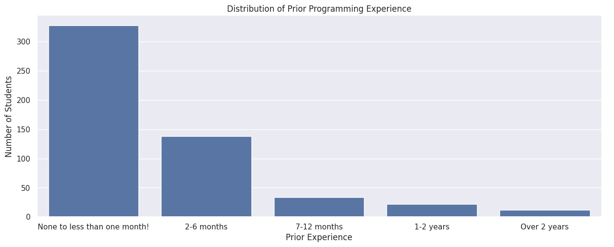
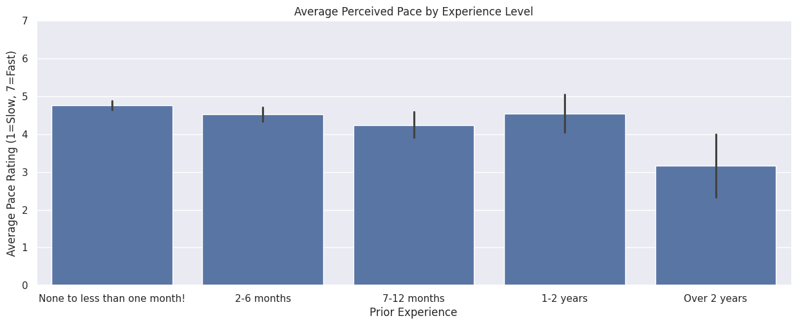
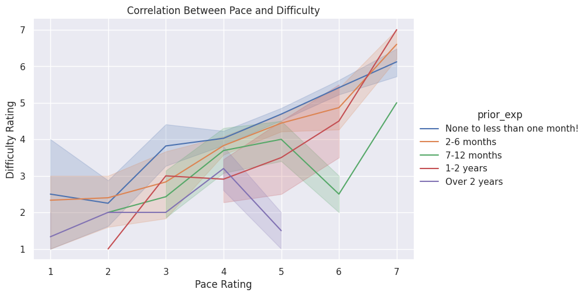

---
# Do not edit the text between these lines!
layout: default
---

# COMP110 Data Analysis: Course Pace and Prior Experience

## Project Summary
For this analysis, I explored the idea that **the course should move at a slower pace considering many students may have little to no experience with programming**. Using the class survey data, I utilized Python and Seaborn to analyze the relationships between a student's prior programming experience, their perception of the course's pace, and the overall difficulty they experienced.

---

## Visualizations and Analysis

### 1. The Stakeholder Majority

The first chart clearly demonstrates that the vast majority of students fall into the "None to less than one month!" experience category. Therefore, course design should prioritize this demographic.

### 2. Perceived Pace by Experience Level

The second chart shows an inverse relationship between prior experience and perceived pace. The majority of students (who fall into the beginner category) feels that this course moves the fastest, at an average pace rating of nearly 5, whereas other groups, specifically those with more than 1-2 years of prior experience, feel as though the pace rates closer to 3.

### 3. The Consequence of Pace

The third chart demonstrates that a higher perceived pace correlates with a higher view on the course's difficulty rating. Notably, the blue line, representing beginner students, sits higher on the difficulty scale across nearly all pace ratings compared to their more experienced counterparts. 

---

## Final Conclusion and Recommendations

The course should consider reducing its overall pace, or adjusting the pace of early foundational concepts, in order to accommodate the large population of students who have little to no background experience in programming. Making this adjustment would increase equity across experience groups and is supported by my analysis and visualizations on pace and difficulty between these groups. 

While slowing down the course is one solution, an alternative solution could be to split the course into two separate sections: one for absolute beginners with little to no prior programming experience, and an accelerated course for those with more than 6+ months of experience. Another solution could be to maintain the course's current pace, but introduce slowly paced supplemental workshops during the first month of the class to aid beginner students. 

The primary trade off of slowing down the course pace is an overall reduction in course material covered by the end of the semester, which could leave student inadequately prepared for future courses. Furthermore, the stakeholders who would not benefit from a reduction in pace are the students with prior programming experience, as these students already view the course as moving at a slower pace than others. Slowing the course down could increase boredom and disengagement, as well as a feeling of not getting as much value out of the course as they believe they should.